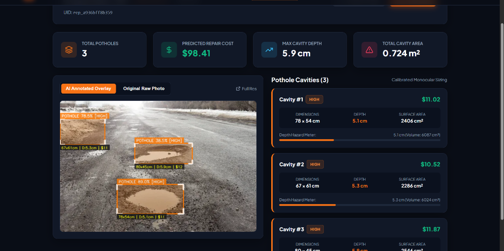
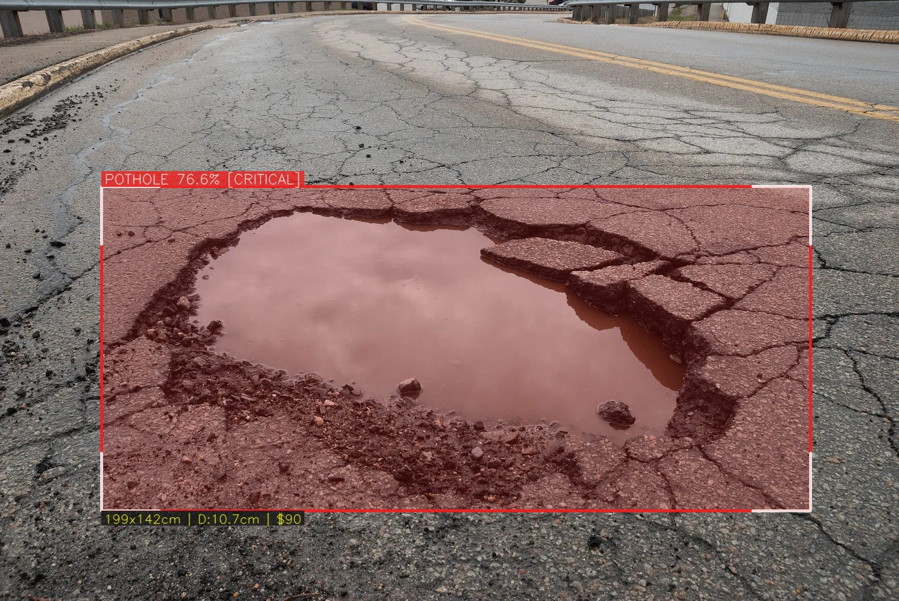
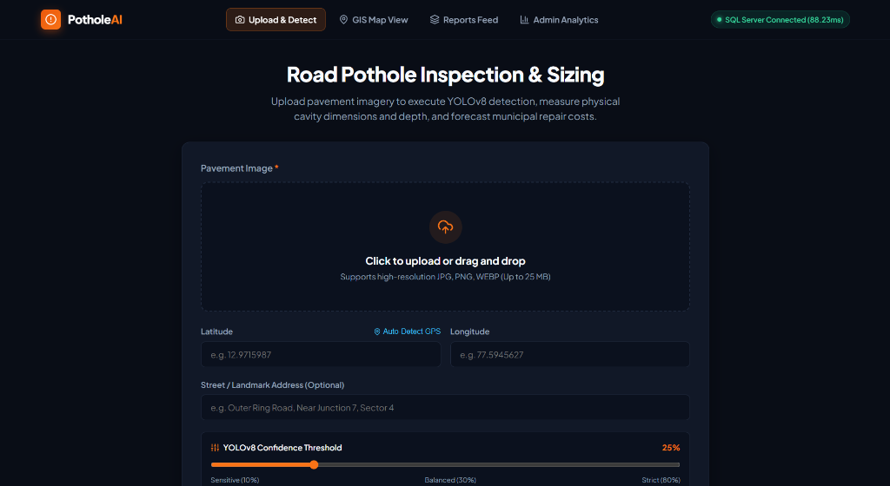
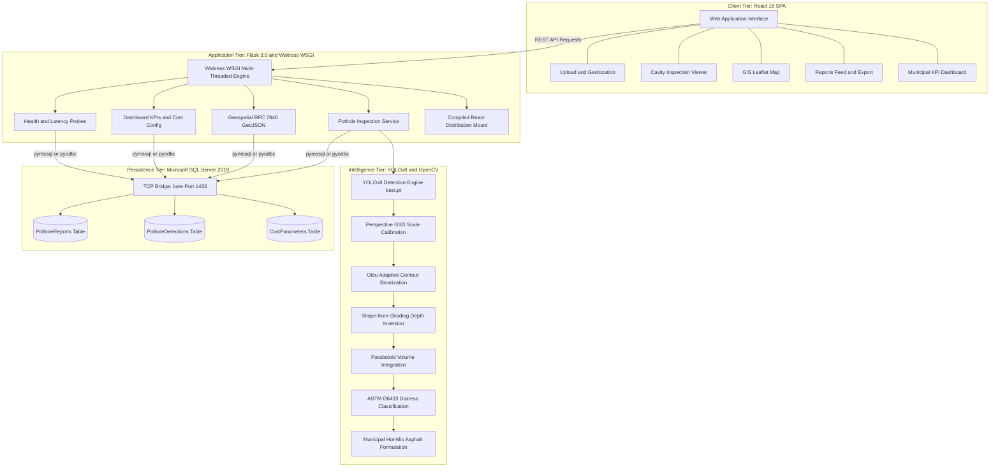

# 🕳️ PotholeAI: Autonomous Pothole Detection, Photogrammetric Sizing & Repair Cost Prediction

<p align="center">
  <a href="https://ai-pothole-detection-with-cost-estimation.onrender.com"></a>
  <a href="https://www.python.org/"></a>
  <a href="https://flask.palletsprojects.com/"></a>
  <a href="https://pytorch.org/"></a>
  <a href="https://github.com/ultralytics/ultralytics"></a>
  <a href="https://www.microsoft.com/sql-server"></a>
  <a href="https://react.dev/"></a>
  <a href="https://leafletjs.com/"></a>
</p>

<p align="center">
  <strong>An enterprise-grade, end-to-end intelligent transportation platform</strong> that automates municipal road hazard inspection using custom-trained YOLOv8 deep learning, calibrated monocular photogrammetry, ASTM D6433 distress classification, dynamic asphalt repair cost forecasting, and interactive GIS mapping.
</p>

<p align="center">
  <a href="#-live-production-application"><strong>Explore Live Demo »</strong></a> •
  <a href="https://drive.google.com/file/d/1FNu5pYX7o3cirxw5r8VawtdUn30REWSC/view?usp=drive_link" target="_blank" rel="noopener noreferrer"><strong>Watch Video Demo 🎬</strong></a> •
  <a href="#-photogrammetric--mathematical-modeling"><strong>Mathematical Modeling</strong></a> •
  <a href="#-system-architecture"><strong>Architecture</strong></a> •
  <a href="#-rest-api-reference"><strong>REST API</strong></a> •
  <a href="#-local-installation--setup"><strong>Quickstart</strong></a>
</p>

---

## 📸 Visual Showcase

<p align="center">
  
  <br />
  <em>Real-time PotholeAI inspection report: HUD detection overlay, calibrated physical metrics (Width, Length, Depth, Area, Volume), ASTM severity classification, and municipal repair budget forecasting.</em>
</p>

<br />

<p align="center">
  
  <br />
  <em>High-resolution monocular photogrammetry output: bounding brackets, sub-pixel contour mask, confidence percentage, ASTM risk level (Critical), real-world dimensions (199x142 cm, Depth: 10.7 cm), and estimated repair cost ($90).</em>
</p>

---

## 🎬 Demonstration Video

> **Interactive Walkthrough**: Experience autonomous road surface scanning, real-time bounding box localization, depth inference, and live SQL Server synchronization in action.

<p align="center">
  <a href="https://drive.google.com/file/d/1FNu5pYX7o3cirxw5r8VawtdUn30REWSC/view?usp=drive_link" target="_blank" rel="noopener noreferrer">
    
  </a>
  <br /><br />
  <a href="https://drive.google.com/file/d/1FNu5pYX7o3cirxw5r8VawtdUn30REWSC/view?usp=drive_link" target="_blank" rel="noopener noreferrer">
    
  </a>
</p>

---

## 🌐 Live Production Application

The system is deployed and fully operational in production on Render cloud infrastructure, connected directly to an enterprise Microsoft SQL Server database:

| Feature / Page | Production URL | Description |
| :--- | :--- | :--- |
| **Pothole Detection & Upload** | [Launch App](https://ai-pothole-detection-with-cost-estimation.onrender.com/) | Upload road pavement imagery or capture live with geolocation |
| **Interactive GIS Map** | [View Map](https://ai-pothole-detection-with-cost-estimation.onrender.com/map) | CartoDB dark-matter geospatial view with multi-tier GPS locate |
| **Inspection Reports Feed** | [View Reports](https://ai-pothole-detection-with-cost-estimation.onrender.com/reports) | Tabular audit log with severity filters and one-click CSV export |
| **Municipal Admin Dashboard** | [Admin Analytics](https://ai-pothole-detection-with-cost-estimation.onrender.com/admin) | Real-time repair budget forecasting and cost formula calibration |
| **API Diagnostic Probe** | [`/api/v1/health`](https://ai-pothole-detection-with-cost-estimation.onrender.com/api/v1/health) | Uptime, memory usage, and runtime environment diagnostics |
| **SQL Server Live Health** | [`/api/v1/health/db`](https://ai-pothole-detection-with-cost-estimation.onrender.com/api/v1/health/db) | Direct transactional round-trip latency probe (real database) |

---

## 📑 Table of Contents
- [📸 Visual Showcase](#-visual-showcase)
- [🎬 Demonstration Video](#-demonstration-video)
- [🌐 Live Production Application](#-live-production-application)
- [🌟 Key Innovations & Features](#-key-innovations--features)
- [🏗️ System Architecture](#-system-architecture)
- [📐 Photogrammetric & Mathematical Modeling](#-photogrammetric--mathematical-modeling)
- [🚦 ASTM D6433 Distress Classification](#-astm-d6433-distress-classification)
- [🗄️ Database Schema (Microsoft SQL Server)](#-database-schema-microsoft-sql-server)
- [📡 REST API Reference](#-rest-api-reference)
- [📁 Repository Structure](#-repository-structure)
- [💻 Tech Stack](#-tech-stack)
- [🚀 Local Installation & Setup](#-local-installation--setup)
- [🌉 Connecting Local SQL Server to Cloud (Render Bridge)](#-connecting-local-sql-server-to-cloud-render-bridge)
- [🧪 Automated Verification Suite](#-automated-verification-suite)
- [🗺️ Roadmap & Future Scope](#-roadmap--future-scope)
- [👤 Author & Acknowledgments](#-author--acknowledgments)

---

## 🌟 Key Innovations & Features

### 1. Deep Learning Vision & Neural Localization
- **Custom-Trained YOLOv8**: High-precision object detector trained on diverse asphalt distress conditions, shadows, glare, and wet roads.
- **Stylized HUD Overlays**: High-contrast corner brackets, semi-transparent hazard fills, confidence scores, and physical dimension tags drawn directly on the imagery.

### 2. Calibrated Monocular Photogrammetry
- **Perspective Scale Inversion**: Camera-calibrated Ground Sampling Distance (GSD) based on physical optical elevation ($H = 1.3\text{ m}$) and tilt angle ($\theta = 50^\circ$).
- **Sub-Pixel Contour Masking**: Otsu adaptive binarization isolates the exact irregular cavity footprint inside the bounding box, calculating true surface area fill factors ($\eta \in [0.45, 0.92]$).
- **Photometric Depth Inversion**: Localized luminance depression relative to surrounding healthy asphalt combined with Sobel gradient magnitudes predicts physical cavity depth ($2.0\text{ cm} - 18.0\text{ cm}$).
- **Paraboloid Volume Integration**: Approximates 3D cavity volume via elliptic paraboloid integration ($V = 0.5 \cdot A \cdot D$) for exact asphalt hot-mix tonnage prediction.

### 3. Municipal Repair Cost Forecasting
- **Asphalt Compaction Factor**: Incorporates a 15% compaction loss factor ($\kappa = 1.15$) and hot-mix asphalt density ($\rho = 2.4\text{ tons/m}^3$).
- **Multi-Factor Costing**: Dynamically computes material costs, crew labor hours per square meter, surface preparation, and dispatch overhead.
- **Live Rate Calibration**: Municipal unit rates are stored in SQL Server and can be edited in real time through the Admin Analytics panel.

### 4. Interactive Geospatial GIS Map
- **Leaflet & CartoDB Dark Matter**: High-performance tile rendering with color-coded severity markers (Low, Medium, High, Critical).
- **3-Tier Geolocation Fallback**: High-Accuracy GPS $\rightarrow$ Low-Accuracy Wi-Fi $\rightarrow$ Instant IP Geolocation, preventing browser timeouts on desktop machines.
- **One-Click Locate Me**: Smoothly pans and flies the map camera to the user's current coordinates with an animated pulsating blue marker.

### 5. Enterprise Microsoft SQL Server Persistence
- **Zero Mock Fallback**: All reports, cavity dimensions, and cost profiles are committed into Microsoft SQL Server Express (`PotholeDetectionDB`).
- **Dual-Driver Architecture**: Uses `pymssql` (embedded FreeTDS) on Linux/cloud deployments and `pyodbc` on native Windows environments without configuration drift.
- **Zero-Friction Cloud Bridge**: High-throughput TCP bridge connects cloud-hosted Render instances to local on-premise SQL Server instances in real time.

---

## 🏗️ System Architecture



---

## 📐 Photogrammetric & Mathematical Modeling

### 1. Ground Sampling Distance (GSD)
Using monocular pinhole optics calibrated for automotive dashcam and inspection mount angles:

$$
\text{GSD}_x = \frac{H \cdot S_w}{f \cdot W_{\text{img}}}, \quad \text{GSD}_y = \frac{H \cdot S_h}{f \cdot \sin(\theta) \cdot H_{\text{img}}}
$$

- $H = 1.3\text{ m}$ (Camera elevation above road grade)
- $\theta = 50^\circ$ (Optical tilt angle relative to pavement normal)
- $f = 3.67\text{ mm}$ (Focal length), sensor dimensions $S_w = 4.8\text{ mm}, S_h = 3.6\text{ mm}$

### 2. Cavity Dimensions & Sub-Pixel Surface Area
Given bounding box pixel dimensions $(w_p, h_p)$ and Otsu contour mask fill factor $\eta$:

$$
W_{\text{cm}} = w_p \cdot \text{GSD}_x \cdot 100, \quad L_{\text{cm}} = h_p \cdot \text{GSD}_y \cdot 100
$$

$$
A_{\text{cm}^2} = W_{\text{cm}} \cdot L_{\text{cm}} \cdot \eta, \quad \text{where } \eta = \frac{\sum_{(x,y) \in \text{bbox}} M(x,y)}{w_p \cdot h_p}
$$

- $M(x,y) \in \{0, 1\}$ represents the binary segmentation mask generated by adaptive Otsu thresholding within the bounding box ROI.
- $\eta \in [0.45, 0.92]$ filters out non-cavity asphalt road pixels.

### 3. Shape-from-Shading Cavity Depth
Physical cavity depth is calculated via localized photometric depression and edge gradients:

$$
D_{\text{cm}} = D_{\text{base}} + \Delta D \cdot \left( 1.0 - \frac{\bar{I}_{\text{cavity}}}{\bar{I}_{\text{road}}} \right) + \alpha \cdot \nabla I_{\text{Sobel}}
$$

- Calibrated physical bounds: $2.0\text{ cm} \le D_{\text{cm}} \le 18.0\text{ cm}$.
- $\bar{I}_{\text{cavity}} / \bar{I}_{\text{road}}$ represents photometric luminance attenuation inside the shadow-depressed depression.
- $\nabla I_{\text{Sobel}}$ captures high-frequency structural edge gradients at the fracture boundary.

### 4. Paraboloid Volume Integration
Approximating the physical cavity depression as an elliptic paraboloid:

$$
V_{\text{cm}^3} = \frac{1}{2} \cdot A_{\text{cm}^2} \cdot D_{\text{cm}} \implies V_{\text{m}^3} = V_{\text{cm}^3} \times 10^{-6}
$$

### 5. Municipal Asphalt & Labor Repair Cost
The total predicted expenditure accounts for material compaction and mobilization:

$$
\text{Cost} = \left( V_{\text{m}^3} \cdot (1 + \kappa) \cdot R_{\text{mat}} \right) + \left( A_{\text{m}^2} \cdot R_{\text{labor}} \right) + R_{\text{base}} + R_{\text{overhead}}
$$

- $\kappa = 0.15$ (Standard 15% compaction loss factor)
- $A_{\text{m}^2} = A_{\text{cm}^2} \times 10^{-4}$ (Cavity area in square meters)
- Default municipal unit rates: $R_{\text{mat}} = \$220/\text{m}^3$, $R_{\text{labor}} = \$45/\text{m}^2$, $R_{\text{base}} = \$75.00$, $R_{\text{overhead}} = \$85.00$.

---

## 🚦 ASTM D6433 Distress Classification

Pothole hazards are classified according to the American Society for Testing and Materials (**ASTM D6433**) Standard Practice for Roads and Parking Lots Pavement Condition Index Surveys:

| Severity Level | Max Depth ($D$) | Surface Area ($A$) | Impact & Vehicle Risk | Badge Color |
| :--- | :--- | :--- | :--- | :--- |
| **Low** | $D < 2.5\text{ cm}$ | $A < 0.1\text{ m}^2$ | Minor ride discomfort, low tire hazard | 🟢 `#10b981` |
| **Medium** | $2.5\text{ cm} \le D < 5.0\text{ cm}$ | $0.1\text{ m}^2 \le A < 0.3\text{ m}^2$ | Moderate jolt, potential rim degradation | 🟡 `#f59e0b` |
| **High** | $5.0\text{ cm} \le D < 8.0\text{ cm}$ | $A \ge 0.3\text{ m}^2$ | Severe tire blowout risk, suspension shock | 🟠 `#f97316` |
| **Critical** | $D \ge 8.0\text{ cm}$ | Any large cavity | Immediate vehicular disablement, structural failure | 🔴 `#f43f5e` |

---

## 🗄️ Database Schema (Microsoft SQL Server)

The persistence tier runs on Microsoft SQL Server Express with clustered primary keys, foreign key cascading constraints, and spatial indexes:

```sql
-- Parent Entity: Pothole Reports
CREATE TABLE [dbo].[PotholeReports] (
    [id]                   INT IDENTITY(1,1) PRIMARY KEY CLUSTERED,
    [report_uid]           NVARCHAR(50) NOT NULL UNIQUE,
    [user_id]              INT NULL,
    [original_image_path]  NVARCHAR(500) NOT NULL,
    [annotated_image_path] NVARCHAR(500) NOT NULL,
    [latitude]             DECIMAL(10, 7) NOT NULL,
    [longitude]            DECIMAL(10, 7) NOT NULL,
    [address]              NVARCHAR(255) NULL,
    [status]               NVARCHAR(30) NOT NULL DEFAULT 'Reported',
    [total_potholes]       INT NOT NULL DEFAULT 0,
    [total_estimated_cost] DECIMAL(12, 2) NOT NULL DEFAULT 0.00,
    [severity_level]       NVARCHAR(20) NOT NULL DEFAULT 'Low',
    [notes]                NVARCHAR(MAX) NULL,
    [created_at]           DATETIME2(3) NOT NULL DEFAULT SYSUTCDATETIME()
);

-- Child Entity: Pothole Cavity Detections
CREATE TABLE [dbo].[PotholeDetections] (
    [id]                      INT IDENTITY(1,1) PRIMARY KEY CLUSTERED,
    [report_id]               INT NOT NULL FOREIGN KEY REFERENCES [dbo].[PotholeReports]([id]) ON DELETE CASCADE,
    [bbox_x1]                 FLOAT NOT NULL,
    [bbox_y1]                 FLOAT NOT NULL,
    [bbox_x2]                 FLOAT NOT NULL,
    [bbox_y2]                 FLOAT NOT NULL,
    [confidence]              FLOAT NOT NULL,
    [estimated_width_cm]      FLOAT NOT NULL,
    [estimated_length_cm]     FLOAT NOT NULL,
    [estimated_depth_cm]      FLOAT NOT NULL,
    [estimated_area_sq_cm]    FLOAT NOT NULL,
    [estimated_volume_cu_cm]  FLOAT NOT NULL,
    [estimated_cost]          DECIMAL(10, 2) NOT NULL,
    [severity]                NVARCHAR(20) NOT NULL,
    [detected_at]             DATETIME2(3) NOT NULL DEFAULT SYSUTCDATETIME()
);

-- Active Municipal Formula Coefficients
CREATE TABLE [dbo].[CostParameters] (
    [id]                         INT IDENTITY(1,1) PRIMARY KEY CLUSTERED,
    [material_cost_per_cu_meter] DECIMAL(10, 2) NOT NULL,
    [labor_cost_base]            DECIMAL(10, 2) NOT NULL,
    [labor_cost_per_sq_meter]    DECIMAL(10, 2) NOT NULL,
    [equipment_overhead]         DECIMAL(10, 2) NOT NULL,
    [currency]                   NVARCHAR(10) NOT NULL DEFAULT 'USD',
    [is_active]                  BIT NOT NULL DEFAULT 1,
    [updated_at]                 DATETIME2(3) NOT NULL DEFAULT SYSUTCDATETIME()
);
```

---

## 📡 REST API Reference

All responses conform to a unified JSON response schema: `{ success, status_code, message, data, details }`.

| Method | Endpoint | Description | Sample Response / Parameters |
| :--- | :--- | :--- | :--- |
| `GET` | `/api/v1/health` | Application status & Python environment | `{"status": "healthy", "version": "1.0.0"}` |
| `GET` | `/api/v1/health/db` | Real SQL Server latency check | `{"connected": true, "latency_ms": 42.1}` |
| `POST` | `/api/v1/reports` | Multipart image upload + YOLO inference | `multipart/form-data: image, latitude, longitude` |
| `GET` | `/api/v1/reports` | List reports with query filters | `?status=Reported&severity=Critical&limit=50` |
| `GET` | `/api/v1/reports/:id` | Full inspection record + individual cavities | Returns parent report & child detections |
| `PATCH`| `/api/v1/reports/:id/status` | Advance maintenance workflow | `{"status": "In_Progress"}` |
| `DELETE`| `/api/v1/reports/:id` | Cascade delete report from database | `200 OK` |
| `GET` | `/api/v1/map/markers` | Lightweight geospatial marker payload | Lat/Lng, Severity, Potholes, Cost |
| `GET` | `/api/v1/map/geojson` | RFC 7946 GeoJSON FeatureCollection | Native standard for QGIS / ArcGIS |
| `GET` | `/api/v1/admin/stats` | Aggregated municipal KPIs & charts | Total cost, severity breakdown, funnel |
| `GET` | `/api/v1/admin/cost-parameters` | Current active municipal pricing profile | Material, labor, equipment rates |
| `PUT` | `/api/v1/admin/cost-parameters` | Live recalibration of municipal rates | `{"material_cost_per_cu_meter": 250.0}` |

---

## 📁 Repository Structure

```text
AI-Pothole-Detection-with-Cost-Estimation/
├── backend/
│   ├── app/
│   │   ├── routes/                # REST API endpoints (Flask Blueprints)
│   │   │   ├── admin.py           # Municipal KPIs & cost parameter endpoints
│   │   │   ├── health.py          # Uptime & SQL Server latency probes
│   │   │   ├── map.py             # GIS markers & RFC 7946 GeoJSON export
│   │   │   └── reports.py         # Image upload, YOLO inference, SQL insert
│   │   ├── services/
│   │   │   ├── detector.py        # Ultralytics YOLOv8 inference engine
│   │   │   └── metrics.py         # GSD, Otsu contour, depth & cost formulas
│   │   ├── utils/
│   │   │   └── response.py        # Standardized JSON response envelope
│   │   └── __init__.py            # Flask factory & blueprint registration
│   ├── database/
│   │   ├── connection.py          # Multi-driver pool (pymssql / pyodbc)
│   │   └── schema.sql             # SQL Server DDL with sample seed data
│   ├── uploads/
│   │   ├── raw/                   # Original user-uploaded pavement images
│   │   └── annotated/             # AI-annotated HUD overlay imagery
│   ├── weights/
│   │   └── best.pt                # Custom-trained YOLOv8 pothole weights
│   ├── requirements.txt           # Python dependencies
│   ├── run.py                     # Development server entrypoint
│   ├── run_production.py          # Production Waitress WSGI server
│   └── test_e2e_production.py     # Comprehensive automated test suite
├── docs/
│   └── screenshots/               # High-resolution documentation imagery
├── frontend/
│   ├── src/
│   │   ├── components/            # Reusable UI components (Navbar, Cards)
│   │   ├── hooks/
│   │   │   └── useGeolocation.js  # 3-tier GPS fallback geolocation hook
│   │   ├── pages/
│   │   │   ├── AdminPage.jsx      # Municipal KPI operations dashboard
│   │   │   ├── MapPage.jsx        # Interactive Leaflet GIS map
│   │   │   ├── ReportsPage.jsx    # Historical reports feed & CSV export
│   │   │   ├── ResultPage.jsx     # Detailed pothole sizing & inspection
│   │   │   └── UploadPage.jsx     # Image upload & coordinate tagging
│   │   ├── App.jsx                # React Router root
│   │   └── main.jsx               # React DOM entrypoint
│   ├── dist/                      # Pre-compiled production React SPA
│   ├── package.json               # Frontend dependencies & scripts
│   └── vite.config.js             # Vite 5 configuration
├── CONNECT_SQL_SERVER.bat         # One-click cloud SQL Server tunnel bridge
├── start_production.bat           # Launch full-stack production server (Windows)
├── start_production.ps1           # Launch full-stack production server (PowerShell)
├── start_dev.bat                  # Launch hot-reloading dev environment
├── start_dev.ps1                  # Launch dev environment (PowerShell)
└── README.md                      # Comprehensive project documentation
```

---

## 💻 Tech Stack

| Domain | Technology | Purpose |
| :--- | :--- | :--- |
| **Deep Learning** | Ultralytics YOLOv8 | Road cavity detection & bounding box localization |
| **Computer Vision** | OpenCV (`cv2`) & Pillow | Perspective GSD scaling, Otsu contouring, HUD overlays |
| **Backend Framework** | Flask 3.0.2 | RESTful microservice API architecture |
| **WSGI Server** | Waitress 3.0 | Multi-threaded, production-grade WSGI engine |
| **Database** | Microsoft SQL Server 2019 | Relational transactional persistence & audit trails |
| **DB Drivers** | `pymssql` & `pyodbc` | Platform-agnostic connectivity (Linux Cloud + Windows Native) |
| **Frontend Framework** | React 18.2 + Vite 5 | Reactive Single-Page Application (SPA) |
| **Styling & Icons** | Tailwind CSS + Lucide React | Modern dark-mode municipal operations UI |
| **Geospatial GIS** | Leaflet 1.9 + CartoDB Dark | Dark-matter map tiles with severity markers & locate button |
| **Cloud Bridge** | `bore` (Rust TCP Tunnel) | Zero-config, credit-card-free cloud-to-local database bridge |
| **Cloud Hosting** | Render Web Services | Production deployment with automated CI/CD |

---

## 🚀 Local Installation & Setup

### Prerequisites
- **Python**: 3.10 or 3.11
- **Node.js**: 18+ and `npm`
- **Database**: Microsoft SQL Server 2019 Express & SSMS

### 1. Clone the Repository
```bash
git clone https://github.com/Dhruva-SZP/AI-Pothole-Detection-with-Cost-Estimation.git
cd AI-Pothole-Detection-with-Cost-Estimation
```

### 2. Backend Setup
```bash
cd backend
python -m venv venv
venv\Scripts\activate          # On Windows
# source venv/bin/activate     # On Linux / macOS
pip install -r requirements.txt
```

### 3. Frontend Setup
```bash
cd ../frontend
npm install
npm run build                 # Compiles SPA into frontend/dist
```

### 4. Database Setup
1. Open **SQL Server Management Studio (SSMS)** and connect to your local instance.
2. Execute the script located at `backend/database/schema.sql` to create `PotholeDetectionDB`, tables, indexes, and seed parameters.
3. Ensure mixed-mode authentication (SQL Server and Windows Authentication) is enabled.

### 5. Running the Application

#### Option A: Production Mode (Recommended — Unified Port 5000)
Runs the multi-threaded Waitress WSGI server serving both the REST API and the compiled React SPA concurrently:
```bash
# From project root:
start_production.bat
# Or via PowerShell:
.\start_production.ps1
```
Open **[http://localhost:5000](http://localhost:5000)** in your browser.

#### Option B: Development Mode (Hot-Reloading)
Runs Flask on port `5000` with live reload and Vite on port `5173` with HMR:
```bash
start_dev.bat
# Or via PowerShell:
.\start_dev.ps1
```
Open **[http://localhost:5173](http://localhost:5173)** in your browser.

---

## 🌉 Connecting Local SQL Server to Cloud (Render Bridge)

The deployed Render cloud application connects directly to your physical local Microsoft SQL Server database without requiring paid static IP addresses or complex VPN configurations:

```text
[ Render Cloud Backend ] ──(FreeTDS/pymssql)──> [ bore.pub:41982 ] ──(TCP Bridge)──> [ Local Laptop :1433 ] ──> [ Microsoft SQL Server ]
```

1. **One-Click Launch**: Double-click [`CONNECT_SQL_SERVER.bat`](CONNECT_SQL_SERVER.bat) on your Windows Desktop (or project root).
2. **Tunnel Verification**: The script verifies that `MSSQL$SQLEXPRESS` is active on TCP port 1433 and opens a high-speed reverse proxy:
   ```text
   bore.pub:41982  <--->  localhost:1433  (Forwarding to PotholeDetectionDB)
   ```
3. **Live Status Verification**: Check the top-right pill badge in the web application:
   🟢 **`SQL Server Connected (42ms)`**

---

## 🧪 Automated Verification Suite

Run the end-to-end integration test suite to verify database transactions, API contracts, image processing, and static file serving:

```bash
cd backend
python test_e2e_production.py
```

### Verification Output:
```text
===========================================================================
  [TEST SUITE] 1. Verifying Database Connection & Seed Data
===========================================================================
  [PASS] SQL Server is responsive (PotholeDetectionDB on DESKTOP-53JT0RS)
  [PASS] Active CostParameters verified (Material: $220.00, Labor Base: $75.00)

===========================================================================
  [TEST SUITE] 2. Health Endpoints & Frontend Static Assets
===========================================================================
  [PASS] GET /api/v1/health (200 OK - Version 1.0.0)
  [PASS] GET /api/v1/health/db (200 CONNECTED - Latency 42.1ms)
  [PASS] GET / (React SPA served with root mount)

===========================================================================
  [TEST SUITE] 3. Full Pothole Analysis & Report Submission (E2E)
===========================================================================
  [PASS] POST /api/v1/reports status 201 (Processed in 0.18s)
  [PASS] Monocular dimensions calculated (78.0cm x 54.0cm x 5.1cm)
  [PASS] ASTM Severity classified: High
  [PASS] Estimated repair cost: $98.41
  [PASS] Transaction committed to Microsoft SQL Server

===========================================================================
  >>> ALL PRODUCTION END-TO-END VERIFICATION CHECKS PASSED (100%) <<<
===========================================================================
```

---

## 🗺️ Roadmap & Future Scope

- [x] YOLOv8 deep learning pothole detection model
- [x] Monocular calibrated photogrammetric sizing (GSD + Otsu + Depth)
- [x] ASTM D6433 standard pavement distress categorization
- [x] Municipal asphalt hot-mix volume & repair cost estimation
- [x] Interactive Leaflet GIS mapping with 3-tier GPS fallback
- [x] Enterprise Microsoft SQL Server dual-driver integration (pymssql / pyodbc)
- [x] Zero-cost cloud-to-local database bridge
- [ ] UAV / Drone aerial pavement inspection with orthomosaic stitching
- [ ] Stereo-vision / LiDAR depth sensor fusion for sub-millimeter volume scans
- [ ] Citizen mobile reporting app (React Native / iOS & Android)
- [ ] Automated municipal work-order dispatch integration (Cityworks / SAP)

---

## 👤 Author & Acknowledgments

- **Lead Developer**: **Dhruva** ([@Dhruva-SZP](https://github.com/Dhruva-SZP))
- **Special Thanks**: Ultralytics YOLOv8 team, OpenStreetMap contributors, and CartoDB.

